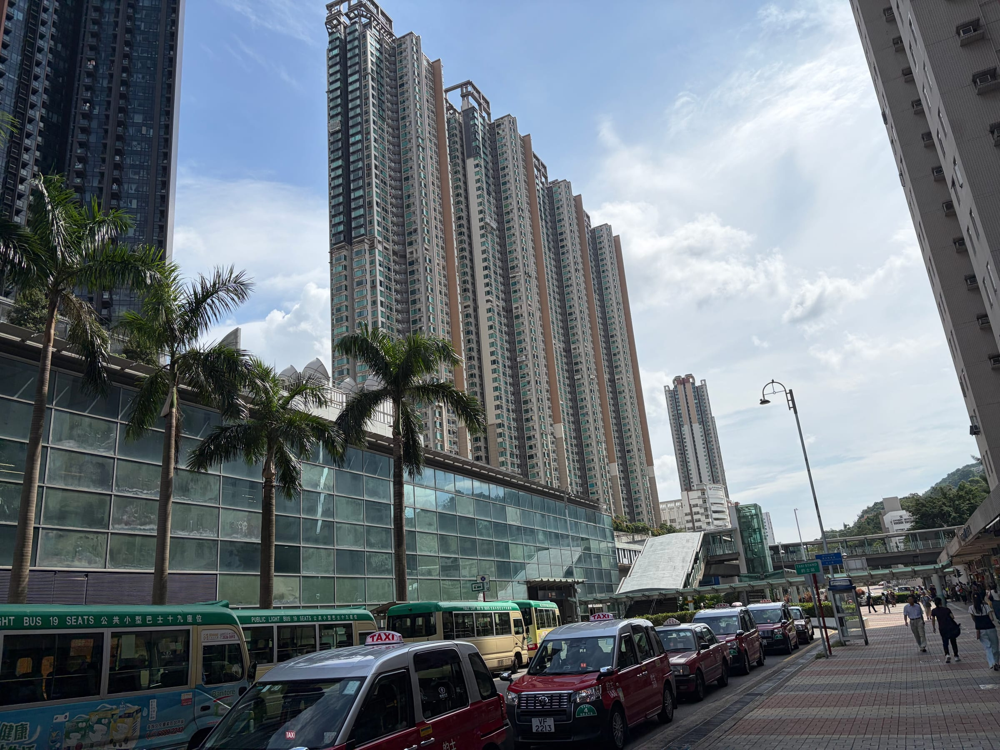
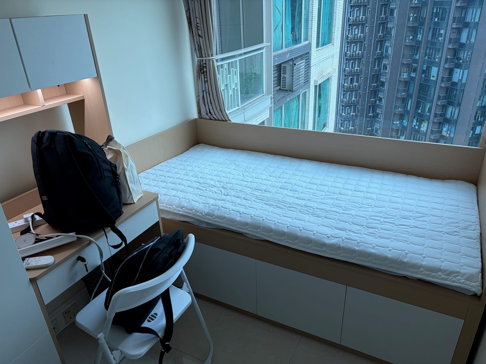

Today is my first day at City University of Hong Kong. I am very happy. I am grateful to City University of Hong Kong for its funding and to [Professor Yue Zhu](https://yuezhu.site) for his support.