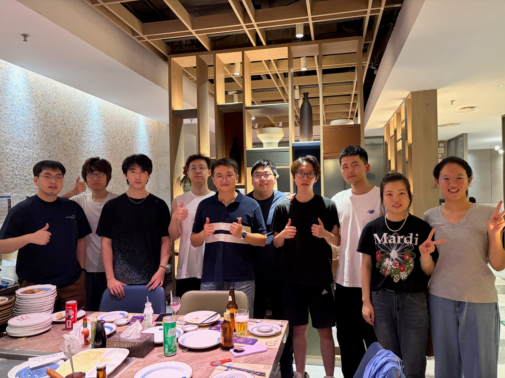
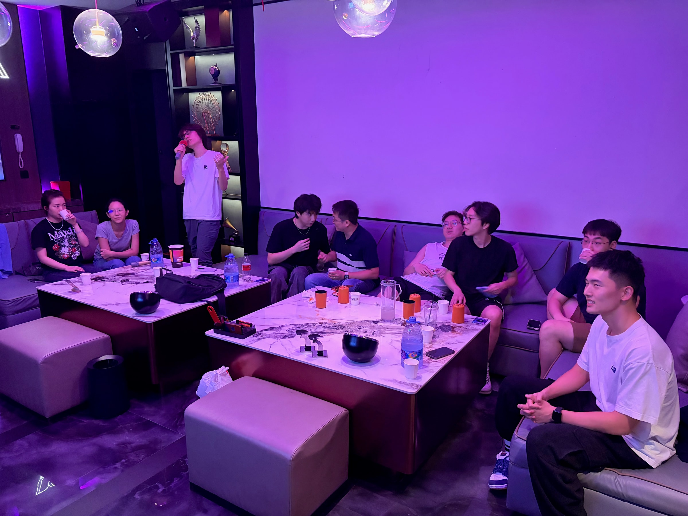

Today our whole research team went out for dinner together. [Professor Yue Zhu](https://www.cityu.edu.hk/stfprofile/yue.zhu.htm) treated all of us to dinner, and before dinner he also took us to karaoke.