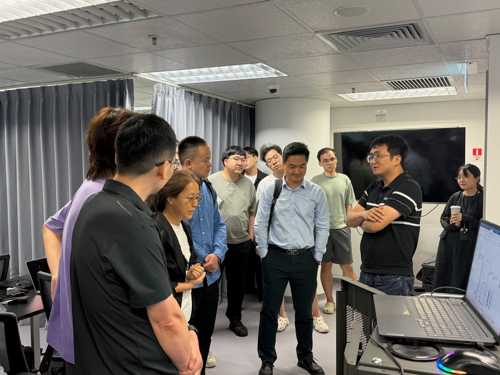
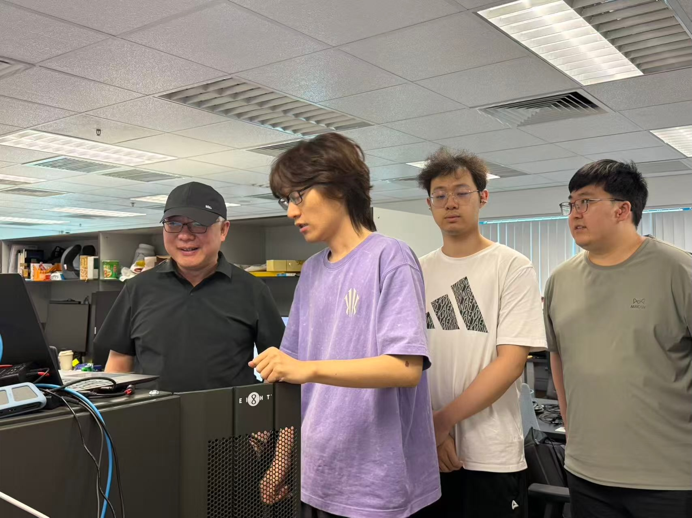
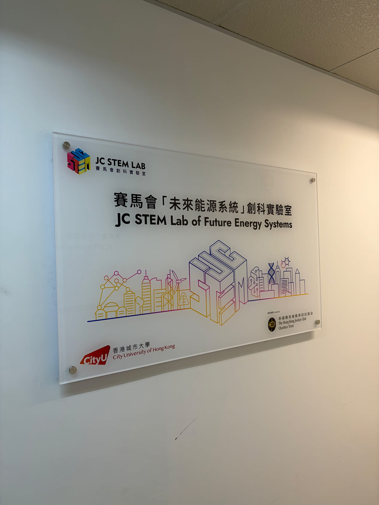

Today, at the JC STEM Lab of Future Energy Systems run by [Professor Z. Y. Dong](https://www.cityu.edu.hk/stfprofile/zydong.htm), Head of Department, my PhD supervisor [Professor Yue Zhu](https://yuezhu.site) hosted a group of visitors. I took part together with several senior students from our group.