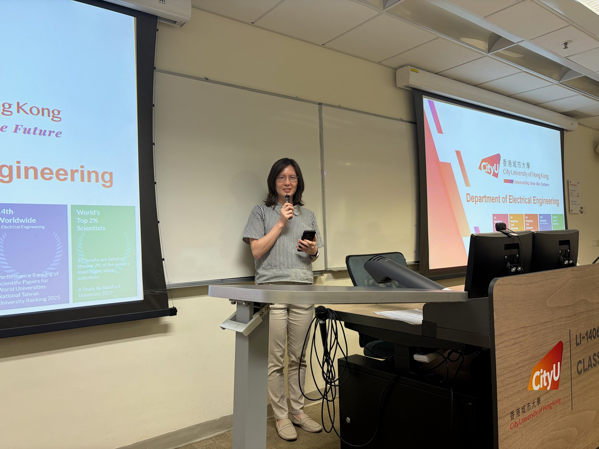
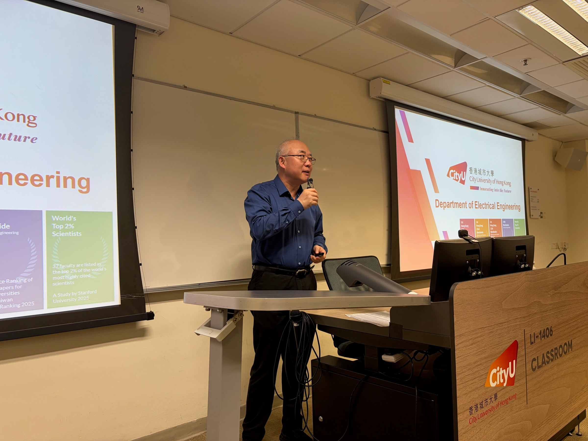

Today is the third day since my PhD programme officially began. The Department of Electrical Engineering held an orientation event for us, and I met several professors who hold administrative positions, including [Professor Leanne Chan](https://www.cityu.edu.hk/stfprofile/lhlchan.htm), the PhD programme leader, and [Professor Z. Y. Dong](https://www.cityu.edu.hk/stfprofile/zydong.htm), Head of the Department of Electrical Engineering.