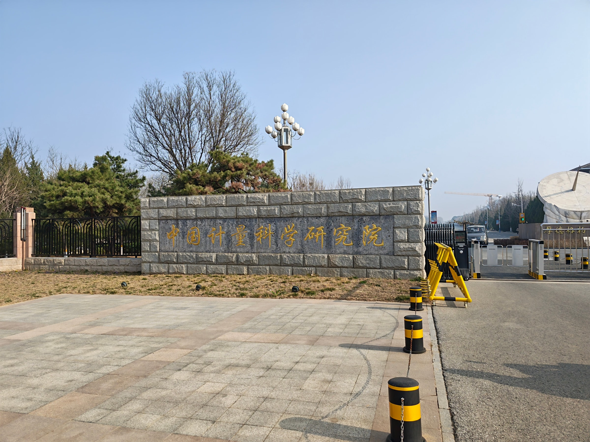
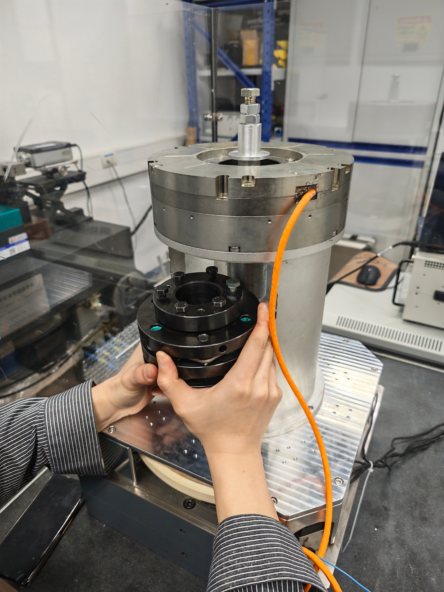

Today I went on a work trip to the National Institute of Metrology, China, located in Changping District, Beijing, to run experiments. I was accompanied by a PhD student from a research group that collaborates with our Shanxi institute.