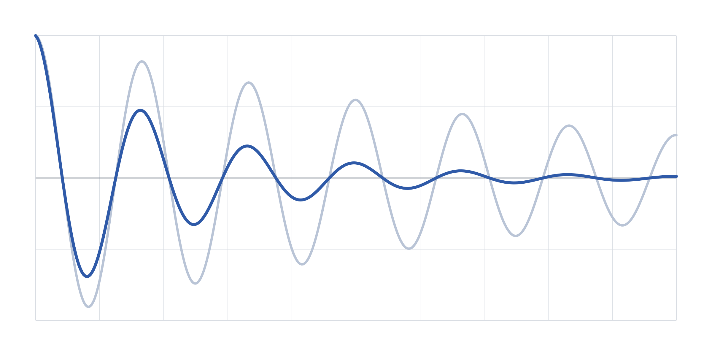

这是一篇示例文章。它标记为草稿，所以只会在运行 `npm run dev` 时出现，不会出现在正式网站上。要写第一篇正式文章，请复制这个文件夹，给副本改一个新名称，然后修改内容。

## 文章的文件夹

文件夹的名称就是文章的网址：文件夹 `writing-a-post` 对应 `/zh-hans/blog/writing-a-post/`。名称请用小写英文字母、数字和连字符。文件夹内有：

- `post.json`，记录各语言共用的信息；
- `en.md`、`zh-hant.md` 和 `zh-hans.md`，每种语言一个文件；
- 文章的图片。

三个语言文件必须齐全。缺少任何一个，构建就会停止并显示提示。

## 文字

段落之间以空行分隔。文字可以*强调*或**加粗**，可以加上[其他网站的链接](https://www.cityu.edu.hk/)，也可以链接到本站的页面，例如[公钥](/zh-hans/public-key/)。

文章内的标题从第二级开始，即两个井号。文章的题目是页面上唯一的第一级标题。

### 较小的标题

编号列表：

1. 先用英文写好内容。
2. 翻译成繁体中文和简体中文。
3. 在 `post.json` 中设置 `"draft": false`。

> 引文会独立成段显示。

## 图片

把图片文件放进文章的文件夹，然后在文中写上文件名。方括号内的文字是图片的描述，供看不到图片的读者阅读，必须填写。引号内的文字会成为图片说明。

构建时会把图片缩小至最宽 1600 像素，并转换为 WebP 格式。原始文件保持不变。

## 表格

| 物理量 | 符号 | 单位 |
| --- | --- | --- |
| 频率 | *f* | Hz |
| 有功功率 | *P* | MW |
| 无功功率 | *Q* | Mvar |

## 文章不能包含的内容

写在 Markdown 文件内的 HTML 会被移除，图片必须是文章文件夹内的文件。这两点都源自本站的安全策略。
